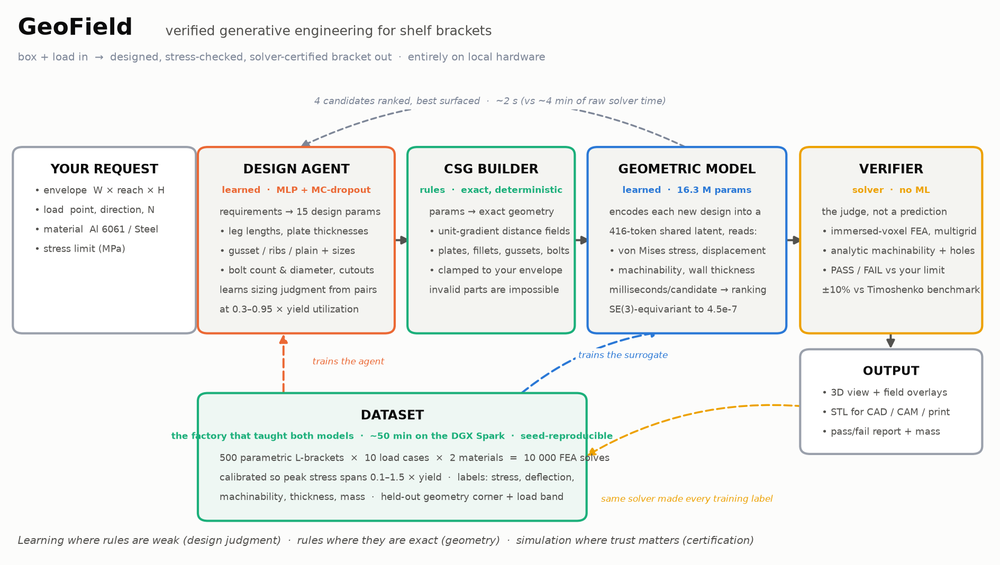
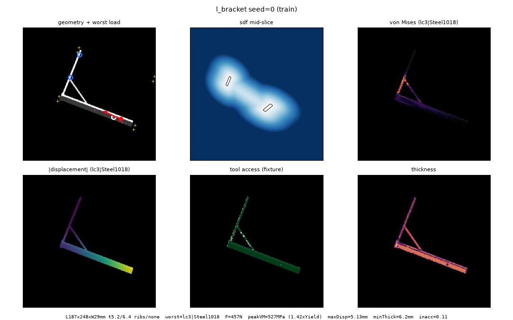
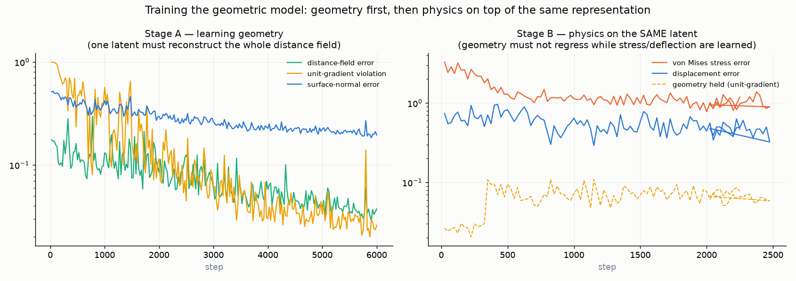
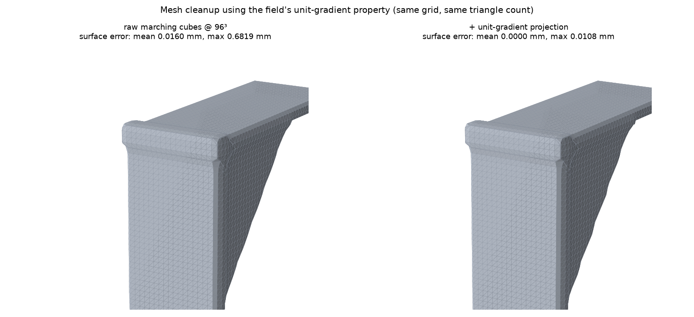
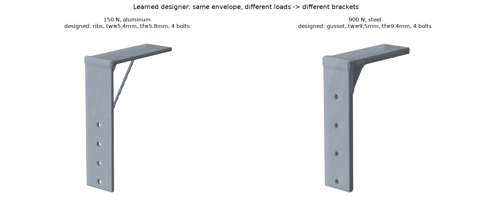
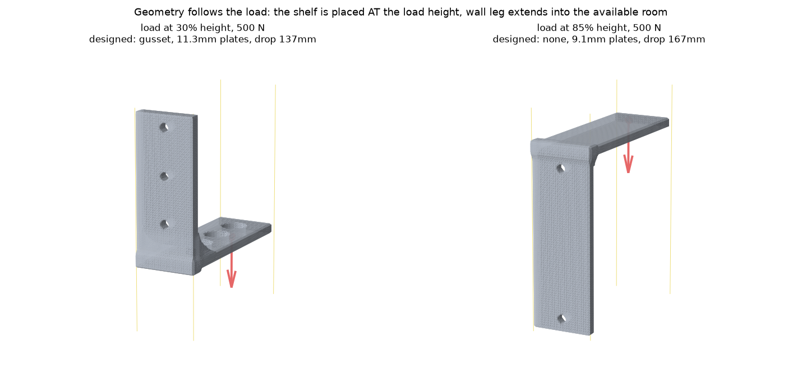

# GeoField — verified generative engineering for shelf brackets

**Give it a box and a load. It designs a bracket that fits and holds, predicts
the stress in milliseconds, and certifies the winner with a real
finite-element solve.** Everything runs on local hardware; no cloud services,
no CAD kernel, no meshes inside the model.



The interesting part is not the bracket — it's the representation. A single
learned latent encodes **geometry, physics, and manufacturability at once**,
and every field is read out of that same latent as a continuous function of
space. Adding a new physics or a new process is a token type, a field head and
a verifier — never a change to the backbone.

---

## Table of contents

- [What this is](#what-this-is)
- [Quick start (5 minutes, no big downloads)](#quick-start)
- [The four components](#the-four-components)
- [The representation: why fields, why one latent](#the-representation)
- [Results](#results)
- [The interactive demo](#the-interactive-demo)
- [Reproducing everything](#reproducing-everything)
- [Repository layout](#repository-layout)
- [What worked, what didn't (read this)](#what-worked-what-didnt)
- [Extending it](#extending-it)
- [Hardware notes & costs](#hardware-notes--costs)
- [Limitations](#limitations)

---

## What this is

A complete, working pipeline for one narrow engineering task — shelf-style
L-brackets — built so that every piece is inspectable:

| Stage | What it does | Learned? |
|---|---|---|
| **Dataset factory** | 500 parametric brackets × 10 engineering load cases × 2 materials = **10 000 immersed-FEA solves**, calibrated so peak stress spans 0.1–1.5 × yield | no — generator + solver |
| **Design agent** | requirements → the bracket program's ~15 parameters (sizes, gusset/ribs, bolts, lightweighting) | **yes** (small MLP) |
| **CSG builder** | parameters → exact geometry as unit-gradient distance fields | no — exact math |
| **Geometric model** | encodes any bracket into a 416-token latent, then reads out stress, deflection, machinability, thickness anywhere in space | **yes** (16.3 M params, SE(3)-equivariant) |
| **Verifier** | re-solves the chosen design with real FEA + analytic manufacturability checks → PASS/FAIL | no — solver |

Design philosophy, in one line: **learning where rules are weak (design
judgment, fast evaluation), rules where they are exact (geometry), simulation
where trust matters (certification).**

---

## Quick start

The repo ships the 324 KB design agent, so the demo runs with **no large
downloads and no GPU**. (Without the geometric-model checkpoint you get
design + exact geometry + FEA verification + STL export; field *prediction*
and candidate ranking need the big checkpoint — see
[Reproducing](#reproducing-everything).)

```bash
git clone <your-fork-url> geofield && cd geofield
python -m venv .venv && . .venv/bin/activate      # Windows: .venv\Scripts\activate
pip install -r requirements.txt

# run the demo server (CPU is fine)
python -m geofield.demo.backend.app --designer models/designer.pt --port 8600
# open http://localhost:8600
```

Sanity-check the engineering core (≈90 tests, ~15 s):

```bash
pytest tests -m "not slow"     # add nothing for the FEA benchmarks (~30 s more)
```

---

## The four components

### 1 · Dataset factory — `geofield/fields/`, `geofield/labels/`, `geofield/data/`



Every shape is a **field**: `f(x) → distance to surface`, negative inside,
with `|∇f| = 1` (a *unit-gradient field*, UGF). Primitives are exact
(`fields/primitives.py`), combined by CSG ops (`fields/ops.py`), and sampled
with importance weighting near the surface (`fields/sampling.py`).

The bracket family (`fields/programs/l_bracket.py`) is parametric in real
millimetres: two plates, corner fillet, optional triangular gusset or
cylindrical ribs, M4–M10 bolt column, optional lightweighting.

Labels per record:
- **Stress + deflection** — `labels/physics.py`: an immersed-voxel FEA solver
  written from scratch in PyTorch. No meshing: element occupancy comes
  straight from the field. Thin plates make the stiffness matrix brutally
  ill-conditioned, so it uses **PyAMG smoothed-aggregation multigrid** with
  the six rigid-body modes as near-nullspace (Jacobi-preconditioned CG does
  not converge at any precision — see [what didn't work](#what-worked-what-didnt)).
  Validated against the analytic Timoshenko cantilever to **within 10 %**.
- **Load-case calibration** — each case is solved at 1 N, then the force is
  scaled so peak stress lands at a *target fraction of yield* (linear
  elasticity ⇒ exact). This is why the dataset covers the regime where design
  decisions actually matter instead of clustering at 0.3 % of yield.
- **Manufacturability** — `labels/manufacturability.py`: 3-axis tool access by
  ray-marching the field from the fixture direction, wall thickness by
  inscribed-sphere growth, plus support/overhang labels (kept for additive,
  unused in this dataset).

### 2 · Design agent — `geofield/model/designer.py`, `geofield/train/designer_loop.py`

Input: 15 invariant features — envelope, load position/direction/magnitude,
material properties, **plus explicit engineering quantities** (moment arm,
bending moment `F·arm`, required section modulus `M/σ_y`). Handing the network
the quantities a hand calculation would use is far more sample-efficient than
making it rediscover the product of its own inputs.

Output: the program's parameters (continuous ones bounded by `sigmoid`, plus
categorical reinforcement style / lightweighting / bolt count).

Training pairs are **filtered by stress utilization**: only (requirement,
design) pairs where that bracket used 30–95 % of the material's yield are
supervision. That is what teaches sizing judgment rather than imitation.
Candidate variety at inference comes from Monte-Carlo dropout sampling.

### 3 · Geometric model — `geofield/model/`, `geofield/train/loop.py`

```
2048 sampled points (position, distance, surface direction) + condition tokens
        │   6 layers of SE(3)-equivariant attention
        ▼
416 posed latent tokens  (384 fine, FPS-initialised + refined; 32 coarse/global)
        │   cross-attention from any query point x
        ▼
field heads:  sdf | von Mises | displacement | tool access | thickness
```

- **Equivariance by construction.** All attention logits are functions of
  SE(3) *invariants* of point pairs (‖Δx‖, gradient dot products, and a
  chirality-preserving determinant); vector channels update as
  invariant-weighted combinations of vectors. Rotate the part *and* the load
  and the answers rotate exactly with them — measured error **4.5 × 10⁻⁷**.
- **Two training stages** (`train/configs/stage_{a,b}.yaml`): Stage A learns
  geometry alone (distance + surface-direction + eikonal + masked-completion
  losses); Stage B adds the physics/manufacturability heads *on the same
  latent* with the pretrained trunk at ¼ learning rate.



- **Field heads predict in log space** (`heads.py: log_scale`) and `decode()`
  inverts it. Stress spans 10⁴–4×10⁸ Pa; a LayerNorm-bounded MLP asked for raw
  pascals collapses to a constant predictor. This one line was the difference
  between a working and a useless surrogate.

### 4 · Verifier — `geofield/verify/`

Decodes the chosen design, re-solves it with the *same* solver that generated
the training labels, runs the analytic machinability and bolt-hole-integrity
checks, and reports PASS/FAIL against your stress limit with the solved peak.
**The model proposes; the solver disposes.**

---

## The representation

Three properties do the work:

1. **Everything is a function, not a mesh.** Shapes are distance fields;
   predictions are functions of `(latent, x)`. There is no resolution baked
   in anywhere — you sample at whatever fidelity a consumer needs (renderer,
   solver, marching cubes).
2. **One latent, many read-outs.** Geometry, stress, deflection,
   machinability and thickness are all decoded from the *same* 416 tokens, so
   the representation is forced to make physics and manufacturability legible
   from shape. That is the central claim, and it is what makes the surrogate
   generalise to designs it never saw.
3. **Unit gradients are exploited, not just assumed.** Because `|∇f| = 1`,
   `f(x)` is exactly how far to travel and `∇f` is the direction — so
   marching-cubes vertices can be Newton-projected onto the true surface and
   normals taken analytically:



Same grid, same triangle count: worst-case vertex error **0.68 mm → 0.011 mm
(63×)**, mean → 0.000 mm (`export/marching_cubes.py`).

---

## Results

Measured on held-out splits (`docs/eval_results.json`, `make figures`):

| Metric | Value |
|---|---|
| Equivariance error (trained model, 1 k rotations) | **4.5 × 10⁻⁷** median |
| Reconstruction Chamfer, validation | **0.0021** |
| Reconstruction Chamfer, **unseen geometry corner** (long legs + thin plates, withheld) | **0.0028** |
| Reconstruction Chamfer, unseen load band | 0.0021 |
| Machinability IoU vs analytic ground truth | 0.64 |
| FEA solver vs analytic Timoshenko cantilever | within **10 %** |
| Candidate evaluation | **~2 s for 4 designs** vs ~4 min of raw solver time |
| Mesh surface error after UGF projection | **0.011 mm** worst case |

The design agent responds to requirements the way an engineer would:



…and the geometry tracks the load, not just the numbers:



---

## The interactive demo

`http://localhost:8600` — everything below is live 3D:

- **Drag the yellow handles** to resize the envelope; **drag the red ball** to
  move the load; **drag the red cone** to aim it in any direction.
- **Live updates**: any change re-designs automatically — a fast preview path
  (**~0.5 s**: designer + exact CSG + refined mesh) while you drag, then a
  full-quality pass with surrogate ranking when you stop.
- **"Show N"** for ranked alternatives (styles, thicknesses, bolt counts) with
  predicted peak stress and mass; click to compare.
- **Colour by** predicted stress / machinability / thickness, hover for values
  at a point, **cut-away** clipping plane, wireframe, snapshot.
- **Verify with FEA** → PASS/FAIL badge with the solved peak stress and
  utilisation. **Download STL** (224³ marching cubes + UGF projection).

Endpoints (`geofield/demo/backend/app.py`): `/make_tokens` `/generate`
`/mesh` `/query_points` `/verify` `/export` `/encode` `/health`.

---

## Reproducing everything

```bash
# 1 · dataset (GPU recommended; ~20 s/record, shard across workers)
python -m geofield.data.generate --n_brackets 500 --out data/l1 \
    [--worker K --n_workers N]        # then: --merge --out data/l1
python -m geofield.data.gallery --data data/l1 --split train --n 24   # eyeball it

# 2 · geometric model
python -m geofield.train.loop --config geofield/train/configs/stage_a.yaml   # geometry
python -m geofield.train.loop --config geofield/train/configs/stage_b.yaml   # + physics
python -m geofield.train.loop --config geofield/train/configs/baseline.yaml  # control

# 3 · design agent (minutes, CPU)
python -m geofield.train.designer_loop --data data/l1 --out runs/designer

# 4 · evaluation figures + results.json
python -m geofield.eval.figures --data data/l1 --model runs/stage_b_l1/ckpt_XXXXXXX.pt

# 5 · demo with the full model (field prediction + ranking)
python -m geofield.demo.backend.app --stage_b runs/stage_b_l1/ckpt_XXXXXXX.pt \
    --data data/l1 --designer runs/designer/designer.pt --port 8600
```

Every record and every run is reproducible from `(seed, config)`.
`--linear_heads` is required only for checkpoints trained before the
log-space head change.

Rough costs on the hardware this was built with: dataset ≈ 50 min (20-core
CPU + GPU), Stage A ≈ 2 h and Stage B ≈ 3.5 h on one H100 (or overnight on a
GB10), design agent ≈ 5 min anywhere.

---

## Repository layout

```
geofield/
  fields/        exact UGF primitives, CSG ops, importance sampling
    programs/    l_bracket.py — the parametric family + build_from_params
  labels/        physics.py (immersed FEA + AMG), manufacturability.py, scalars.py
  tokens/        typed condition tokens (SE(3)-aware) + registry
  data/          generate.py (sharded), dataset.py, splits.py, gallery.py
  model/         encoder / latent / decoder / heads / designer / flow / guidance
  train/         loop.py (guards: spike, rollback, trunk-lr), designer_loop.py, configs/
  eval/          rotation, reconstruction, surrogate, probes, mfg, figures
  verify/        fea.py, mfg.py, report.py
  export/        marching_cubes.py (UGF projection, analytic normals, STL)
  demo/          backend/app.py (FastAPI) + frontend/index.html (Three.js)
tools/           status.py dashboard, system_graphic.py, training_figure.py
tests/           ~90 tests: field math, tokens, FEA benchmarks, model equivariance
models/          designer.pt (324 KB, committed)
docs/            figures + eval_results.json
```

---

## What worked, what didn't

Honest engineering log — the failures are more informative than the wins.

**Worked**
- Immersed FEA straight from the field (no meshing) + AMG. Validated to 10 %.
- Yield-fraction calibration of load magnitudes. Without it, 99 % of the
  dataset sits at <1 % of yield and nothing about design is learnable.
- SE(3)-equivariance by construction — and it *trains faster*: the equivariant
  model reached better losses in ~1/7 the wall-clock of the augmentation-based
  control.
- Log-space field heads. Non-negotiable for quantities spanning decades.
- UGF vertex projection for meshing (63× accuracy at zero extra cost).
- Explicit engineering features (moment, section modulus) for the design agent.
- Training guards: component-aware spike rejection with absolute floors,
  auto-rollback on collapse, ¼ learning rate on the pretrained trunk, never
  checkpoint a collapsed model.

**Didn't work (and why)**
- **Free-form generation in the analysis latent.** A flow-matching model over
  the 416-token latent trains beautifully (loss 1.97 → 0.38) and produces
  *blobs*. Diagnostic that settled it: decode the **midpoint between two real
  brackets' latents** → empty space, every time. The reconstruction-optimised
  manifold is non-convex; valid designs are isolated islands. No
  transport-based generative model can work there, and **more data does not
  fix it**. A generation-friendly latent (canonical frame, single compact
  vector, interpolation regularisation — i.e. VAE-style) is the documented
  path if you want to try. The flow code is all here (`model/flow.py`,
  `model/guidance.py`) behind `mode: "flow"`.
- **Raw-pascal stress heads** — collapsed to a constant predictor twice before
  the log-space diagnosis. The training loss looked *fine*.
- **Jacobi-preconditioned CG on thin plates** — never converges, not even in
  float64. Multigrid or bust.
- **Sphere-growing thickness as a "minimum wall" scalar** — legitimately goes
  to zero at edges; use ray-chord thickness for the scalar and keep
  inscribed-sphere for the field.
- **Exact Hungarian optimal transport** in the flow trainer — 1.75 s/batch and
  pathological cases that stall forever; rank-pairing along a random
  projection is 5× faster and adequate.

---

## Extending it

The extension contract is the point of the architecture. To add a domain:

1. **A token type** — `tokens.schema.register_token_type(name, param_schema)`.
   Params declared `direction`/`vec3` transform with the field automatically;
   `size3` scales but does not rotate. Unknown types are ignored with a warning.
2. **A field head** — `model.heads.register_field(field_id, out_dim, loss,
   head_cls, equivariant, cond_types, log_scale)`. Heads are built from the
   registry, so nothing else changes.
3. **A labeler and a verifier** — one function that computes ground truth, one
   that certifies a decoded design (`labels/`, `verify/`).

New shape family? Add a `fields/programs/*.py` with `sample()` and
`build_from_params()`. The backbone, the training loop, and the demo are
family-agnostic.

---

## Hardware notes & costs

Built on: an RTX 4060 (8 GB) workstation, an NVIDIA DGX Spark (GB10, 121 GB
unified — excellent data factory and inference host, memory-bandwidth-bound
for training), and ~18 h of a rented H100 (~$75) for the training runs.

Practical notes: dataset generation is CPU/AMG-bound and shards linearly;
training is bandwidth-bound (an H100 is ~6× a GB10 here); `torch.compile` on
the attention blocks is a ~2× win; the demo runs comfortably on CPU.

---

## Limitations

- One narrow family (shelf L-brackets), one process (3-axis machining), linear
  static elasticity, isotropic materials, single load case per evaluation.
- The stress *surrogate* is a ranking aid, not a certification; the FEA
  verifier is the only trustworthy number in the loop, and it is itself a
  research-grade solver validated on one benchmark.
- Free-form geometry generation is **not** delivered (see above). What ships is
  generative *design*: a learned agent choosing parameters, exact construction,
  learned evaluation, solver certification.
- No fatigue, buckling, bolt-preload, contact, or thermal analysis.
- See `LICENSE` for the engineering disclaimer. This is a demonstrator.
